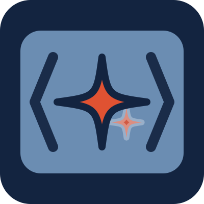

<div align="center">



# aibox

**Reproducible AI workspaces from one `aibox.toml`.**

[](SECURITY.md)
[](LICENSE)
[](https://projectious-work.github.io/aibox/v1.x/)

</div>

---

> [!NOTE]
> **Project status:** actively maintained. The latest minor release line is
> supported; security and correctness fixes are released on the newest version.
> See [SECURITY.md](SECURITY.md) for reporting and support details.

---

`aibox` is a Rust CLI for projects that want a dependable terminal-first AI
development environment without hand-maintaining devcontainer glue. It turns a
declarative `aibox.toml` into standard `.devcontainer/` files, a project image,
runtime UI configuration, selected AI harnesses, and pinned processkit context
under `context/`.

The design goal is simple: a fresh clone plus `aibox apply` should reproduce the
same workspace, with the same tools, the same agent entry points, and the same
project context.


## Why aibox

AI-assisted work fails quickly when the environment is half-local, half-memory,
and only reproducible on one machine. aibox keeps the moving parts explicit:

- **One project contract:** `aibox.toml` declares the base image, container
  identity, addons, AI harnesses, theme, layout, and processkit source/version.
- **Standard container output:** generated `.devcontainer/Dockerfile`,
  `docker-compose.yml`, `docker-compose.override.yml`, and `devcontainer.json`
  remain understandable to Docker, Podman, OrbStack, and VS Code.
- **Composable tools:** addons install language runtimes, AI CLIs, preview
  tools, infrastructure CLIs, and documentation frameworks only when selected.
- **Provider-neutral context:** `AGENTS.md` is the canonical agent entry point;
  provider files such as `CLAUDE.md` are thin pointers.
- **Pinned process layer:** processkit supplies skills, schemas, state machines,
  processes, and package definitions. aibox installs and updates that content.
- **Runtime visibility:** `aibox get runtime --resources` and `aibox doctor`
  surface memory pressure, OOM signals, and process count risks before they turn
  into unexplained agent exits.

## Install

Install a supported container runtime first:

- Podman, including a Compose provider
- Docker or Docker Desktop
- OrbStack with Docker-compatible Compose

Install the stable CLI:

```bash
curl -fsSL https://raw.githubusercontent.com/projectious-work/aibox/main/scripts/install.sh | bash
aibox --version
```

This branch documents the v1 preview. After `v1.0.0-alpha.1` is published,
install that exact prerelease instead of relying on the stable channel:

```bash
curl -fsSL https://raw.githubusercontent.com/projectious-work/aibox/main/scripts/install.sh |
  VERSION=1.0.0-alpha.1 bash
aibox --version
```

Prerelease installation and rollback are covered in the
[v1 installation guide](https://projectious-work.github.io/aibox/v1.x/docs/getting-started/installation/).

## Quick Start

```bash
mkdir my-project && cd my-project
git init

aibox init my-project --harness claude --addon python
aibox apply
aibox up
```

This creates:

- `aibox.toml` as the source of truth
- generated `.devcontainer/` files
- `.aibox-home/` for persistent runtime config, ignored by git
- `context/` with processkit-managed project context
- root-level `AGENTS.md` plus thin provider pointers
- a tmux workspace mounted at `/workspace`

For an existing project, start with the
[existing-project guide](https://projectious-work.github.io/aibox/docs/getting-started/existing-project).

## Core Workflow

```bash
aibox apply                         # reconcile config, processkit content, files, and image
aibox apply --no-cache              # rebuild image without cached layers
aibox up                            # start or attach to the workspace
aibox up --layout focus             # override layout for one session
aibox get runtime --resources       # inspect memory/process pressure
aibox doctor                        # validate project and runtime posture
```

Older command names such as `aibox sync`, `aibox start`, and `aibox status`
were replaced by the current verb/resource grammar. See the
[CLI reference](https://projectious-work.github.io/aibox/docs/reference/cli-commands)
for the mapping.

## How It Fits Together

| Layer | Owned by | What it contains |
| --- | --- | --- |
| Project contract | aibox | `aibox.toml`, `aibox.lock`, `.aibox-version` |
| Container output | aibox | `.devcontainer/`, generated Compose, devcontainer JSON |
| Runtime home | aibox | `.aibox-home/` tmux, shell, theme, and tool config |
| Addons | aibox | YAML definitions for installable tools and runtimes |
| Process content | processkit | skills, processes, schemas, state machines, `AGENTS.md` template |
| Project context | shared | editable `context/` content plus immutable upstream snapshots |

aibox intentionally does not own process semantics. If a behavior is about how
agents plan, record decisions, or manage work items, it belongs in processkit.
If it is about generating containers, selecting addons, wiring harness config,
or launching the workspace, it belongs in aibox.

## Documentation

Full documentation for this v1 preview line lives at
**[projectious-work.github.io/aibox/v1.x/](https://projectious-work.github.io/aibox/v1.x/)**
(the stable v0.x docs are at the site root).

| Section | Contents |
|---------|----------|
| [Getting Started](https://projectious-work.github.io/aibox/v1.x/docs/getting-started/) | Installation, new project, existing project |
| [Container](https://projectious-work.github.io/aibox/v1.x/docs/container/) | Base image, configuration, runtime operations, audio, file preview |
| [Addons](https://projectious-work.github.io/aibox/v1.x/docs/addons/) | Overview, language runtimes, tool bundles, documentation frameworks |
| [Providers](https://projectious-work.github.io/aibox/v1.x/docs/providers/) | Claude, OpenAI, Gemini, Copilot, Continue, Aider, Mistral |
| [Context System](https://projectious-work.github.io/aibox/v1.x/docs/context/) | Overview, skill selection, migration |
| [Customization](https://projectious-work.github.io/aibox/v1.x/docs/customization/) | Themes, layouts, prompts |
| [Reference](https://projectious-work.github.io/aibox/v1.x/docs/reference/) | Configuration, CLI commands, compatibility, cheatsheet, v1 deployment boundaries |
| [Contributing](https://projectious-work.github.io/aibox/v1.x/docs/contributing/) | Maintenance, e2e tests, version-line porting |

## Development

This repository is developed inside its own devcontainer.

```bash
cd cli && cargo build
cd cli && cargo test
cd cli && cargo clippy --all-targets -- -D warnings
cd cli && cargo fmt -- --check
```

For full container lifecycle tests:

```bash
cd cli && cargo test --features e2e
```

Release quality expectations are strict:

- zero Clippy warnings
- all tests passing
- `cargo audit` clean before tagging
- releases created through `./scripts/maintain.sh release <version>`

## Repository Structure

| Path | Purpose |
| --- | --- |
| `cli/` | Rust CLI source for the `aibox` binary |
| `addons/` | YAML addon definitions for runtimes, tools, docs frameworks, and AI CLIs |
| `images/` | Base image recipes published for downstream projects |
| `docs-site/` | Hugo/Docsy documentation site |
| `context/` | This repository's processkit-managed project context |
| `scripts/` | Release, install, and maintenance tooling |
| `.devcontainer/` | This repository's own development container |

## Contributing

Direct commits to `main` are the norm in this repository. Before contributing,
read [AGENTS.md](AGENTS.md), [CONTRIBUTING.md](CONTRIBUTING.md), and the docs
under [`docs-site/content/docs/contributing/`](docs-site/content/docs/contributing/).

Do not hardcode processkit vocabulary in production Rust code. Add constants to
`cli/src/processkit_vocab.rs` instead.

All build, test, documentation, and release gates run locally. This repository
does not use GitHub Actions; see the
[maintenance guide](https://projectious-work.github.io/aibox/docs/contributing/maintenance)
for the exact commands and release phases.

## License

MIT. See [LICENSE](LICENSE).

Unless otherwise noted, the copyright holder grants the MIT License for all
versions of this repository, including historical commits and tags.

Brand and design system © [projectious.work](https://github.com/projectious-work/brand).
The aibox mark is derived from that system.
